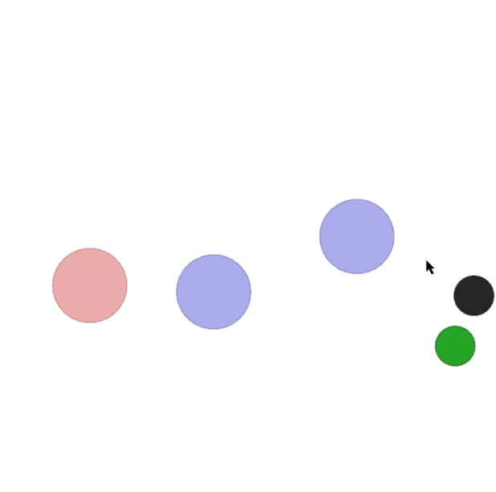

  

# Multi-Agent Particle Environment

A simple multi-agent particle world with a continuous observation and discrete action space, along with some basic simulated physics.
Used in the paper [Multi-Agent Actor-Critic for Mixed Cooperative-Competitive Environments](https://arxiv.org/pdf/1706.02275.pdf).

# A simple implementation of MADDPG
a simple implementation of MADDPG based on (https://github.com/philtabor/Multi-Agent-Deep-Deterministic-Policy-Gradients)
